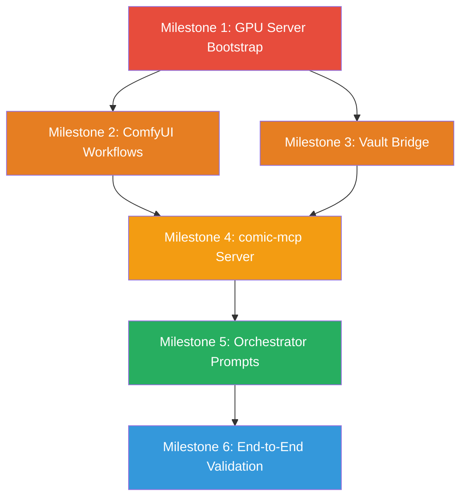

# Implementation Plan — Chapter-to-Comic Pipeline

Build the autonomous comic generation pipeline in 6 milestones, ordered by dependency chain. Each milestone produces a testable deliverable before moving on.

## User Review Required

> [!IMPORTANT]
> **GPU server location**: The specs reference `192.168.1.10` as the ComfyUI/Ollama compute node. Is this your actual local GPU machine, or will this change (e.g., your VPS, or a cloud GPU)?

> [!IMPORTANT]
> **Separate repo or subdirectory?** Should `comic-mcp` live as a subdirectory inside the `aymeric` repo (e.g., `comic/comic-mcp/`), or as a standalone repo? A subdirectory keeps everything together; a separate repo makes it reusable for other books. The plan below assumes subdirectory — flag if you want otherwise.

> [!IMPORTANT]
> **First test chapter**: Which Log do you want to use for the end-to-end test? Log #1 is the longest (~20K chars, dialogue-heavy, 3 locations, 2 characters) — good stress test. A shorter chapter would validate faster. Your call.

## Open Questions

> [!WARNING]
> **ComfyUI state**: Do you already have ComfyUI installed and running on `192.168.1.10`, or does Milestone 1 need to include a full setup from scratch? Same question for Ollama.

> [!WARNING]
> **Art style direction**: Do you already have moodboard images or a target art style in mind (e.g., European BD, western comic, manga)? This affects which checkpoint + LoRA we select in Milestone 2.

---

## Milestone 1 — GPU Server Bootstrap
**Goal**: ComfyUI and Ollama running on the compute node, accepting remote API calls.
**Duration**: ~1 session

### Tasks

#### 1.1 Ollama Setup
- Install Ollama on `192.168.1.10`
- Configure `OLLAMA_HOST=0.0.0.0` for network access
- Pull a JSON-capable model: `ollama pull llama3` (8B)
- **Verify**: `curl http://192.168.1.10:11434/api/generate -d '{"model":"llama3","prompt":"Reply with valid JSON: {\"test\": true}"}'` returns valid JSON

#### 1.2 ComfyUI Setup
- Install ComfyUI with `--listen 0.0.0.0` flag
- Download SDXL checkpoint (Juggernaut XL v10 recommended for 12GB VRAM)
- Download comic style LoRA (will narrow down based on art direction answer)
- Install required custom nodes via ComfyUI Manager:
  - `ComfyUI-IPAdapter-Plus`
  - `ComfyUI-ControlNet-Union-ProMax`
  - `comfyui_controlnet_aux`
  - `ComfyUI-Impact-Pack`
  - `ComfyUI-Ultralytics-YOLO`
- Download IP-Adapter models (FaceID + Plus) and CLIP Vision models
- **Verify**: Open `http://192.168.1.10:8188` in browser, run a basic txt2img workflow

#### 1.3 ImageMagick
- `sudo apt-get install imagemagick` on the server
- **Verify**: `magick --version` returns a version string

#### 1.4 Vault Directory Structure
- Create the vault directory tree on the compute node:
  ```
  /vault/
  ├── characters/
  ├── locations/
  ├── temporary/
  ├── moodboard/
  │   ├── style/
  │   ├── characters/
  │   ├── environments/
  │   └── palette/
  └── style/
  ```

### Deliverable
A running GPU server where `curl` calls to ComfyUI and Ollama both succeed from the orchestration machine.

---

## Milestone 2 — ComfyUI Workflow Templates
**Goal**: All 6 workflow `.json` files built, exported, and tested manually in ComfyUI.
**Duration**: ~1–2 sessions (hands-on ComfyUI node wiring)

### Tasks

#### 2.1 `exploration.json`
- Build in ComfyUI UI: SDXL → KSampler → VAE Decode → LoRA → Save Image
- Add two bypassable IP-Adapter Plus nodes (Branch A: style, Branch B: reference)
- Wire bypass switches
- Test: generate a character from text-only prompt, then re-test with a moodboard reference image in Branch A
- Export as JSON, replace literal values with `{{PLACEHOLDER}}` tokens

#### 2.2 `base_panel.json`
- Build: SDXL → KSampler → VAE Decode → LoRA → IP-Adapter Plus (body, slot 1) → IP-Adapter FaceID (face, slot 2) → ControlNet Union (depth, optional) → YOLO Face Detector (bypassable) → Save Image
- Test: generate a panel with IP-Adapter body reference + text prompt, verify face detection returns bounding box JSON
- Export and templatize

#### 2.3 `face_extract.json`
- Build: same as base but force-prefix portrait terms, lock resolution to 512×512, no IP-Adapter/ControlNet
- Test: generate a clean portrait from a character description
- Export and templatize

#### 2.4 `body_extract.json`
- Same approach as face_extract but full-body T-pose, neutral background
- Export and templatize

#### 2.5 `depth_extract.json`
- Build: Load Image → Zoe Depth Preprocessor → Save Image
- Test: feed a location image, verify depth map output
- Export and templatize

#### 2.6 Store templates
- Save all 5 templates to `comic/workflows/`
- Document any checkpoint/LoRA-specific node IDs that may need updating if models change

### Deliverable
A `comic/workflows/` directory with 5 tested `.json` templates, each using `{{PLACEHOLDER}}` syntax.

---

## Milestone 3 — Vault Bridge Script
**Goal**: Convert existing `world/` data into Vault JSON skeletons, ready for the Exploration Phase.
**Duration**: ~1 session

### [NEW] `comic/scripts/vault_bridge.py`

#### 3.1 Core converter
- Read all `.md` files in `world/characters/` and `world/locations/`
- Parse YAML frontmatter (reuse the `pyyaml` dep already in the project)
- Extract `## Description` section text
- Generate `entity_id` from `name` (lowercase, spaces → underscores, strip accents)
- Write skeleton `.json` to `/vault/characters/` and `/vault/locations/` with `physical_description` set to raw French text, `assets` set to `null`

#### 3.2 Alias lookup table
- Build `alias_map.json` from all character `aliases` frontmatter fields
- Store at `/vault/alias_map.json`

#### 3.3 LLM description rewrite (optional batch mode)
- `--rewrite` flag: for each skeleton, send the French description to Ollama and ask for an SDXL-optimized English `physical_description`
- Save the rewrite alongside the original for human review
- The user approves/edits each rewrite before it becomes the canonical version

### Deliverable
22 character skeletons + 10 location skeletons in `/vault/`, plus `alias_map.json`. Descriptions need review but the structure is ready.

---

## Milestone 4 — The `comic-mcp` Server
**Goal**: A working Python MCP server exposing all 6 tools from `mcp_server_spec.md`.
**Duration**: ~2–3 sessions (the largest milestone)

### [NEW] `comic/comic-mcp/`

#### 4.1 Project scaffold
```
comic/comic-mcp/
├── pyproject.toml
├── comic_mcp/
│   ├── __init__.py
│   ├── server.py            # MCP server entrypoint
│   ├── config.py            # TOML config loader
│   ├── tools/
│   │   ├── __init__.py
│   │   ├── ollama.py        # ollama_generate_panel
│   │   ├── comfyui.py       # comfy_generate_image
│   │   ├── assembly.py      # magick_assemble
│   │   ├── webtoon.py       # generate_webtoon_html
│   │   └── vault.py         # vault_query + vault_commit
│   ├── comfy_client.py      # WebSocket client for ComfyUI API
│   ├── template_patcher.py  # Workflow JSON template patching
│   └── errors.py            # Structured error codes
└── comic-mcp.toml           # Default config
```

**Dependencies**: `mcp` (Python MCP SDK), `websockets`, `httpx`, `tomli`, `Pillow`

#### 4.2 Build order (by dependency)

**Layer 1 — Config + Errors** (no external deps)
- `config.py`: Load `comic-mcp.toml`, validate required fields, expose typed config object
- `errors.py`: Define error code enum and structured error response format

**Layer 2 — Clients** (talks to external services)
- `comfy_client.py`: WebSocket connection to ComfyUI
  - `submit_prompt(workflow_json)` → prompt_id
  - `wait_for_completion(prompt_id, timeout)` → output images
  - `cancel_prompt(prompt_id)`
  - `get_image(filename)` → bytes
  - **Test**: submit a minimal txt2img workflow, get back an image
- `template_patcher.py`: Load template JSON, walk nodes, replace `{{PLACEHOLDERS}}`, handle bypass switch toggling for IP-Adapter nodes
  - **Test**: patch `exploration.json` with test values, verify valid JSON output

**Layer 3 — Tools** (business logic)
- `vault.py`: `vault_query` + `vault_commit` — pure filesystem operations, JSON read/write, image copy
  - **Test**: write a test vault entry, query it back
- `assembly.py`: `magick_assemble` — subprocess calls to ImageMagick
  - **Test**: assemble 3 solid-color test images into a `3_panel_strip`, verify dimensions
- `ollama.py`: `ollama_generate_panel` — HTTP POST to Ollama, parse JSON response, retry on malformed output
  - **Test**: send a beat + character data, get back a valid `panel_payload` object
- `comfyui.py`: `comfy_generate_image` — orchestrates template_patcher + comfy_client + optional YOLO extraction
  - **Test**: generate a single image using `exploration.json` template, verify file written to output_path
- `webtoon.py`: `generate_webtoon_html` — build HTML from page data, position bubbles using bounding box avoidance algorithm
  - **Test**: generate HTML with mock panel data + dialogue, open in browser

**Layer 4 — Server**
- `server.py`: Wire all tools into the MCP SDK, register tool schemas, handle stdio transport
  - **Test**: start server, connect via MCP client, call each tool

#### 4.3 Integration tests
- Full round-trip: `vault_commit` → `comfy_generate_image` (using vault asset) → `magick_assemble` → verify output
- Error scenarios: unreachable ComfyUI, malformed Ollama JSON, missing panel files

### Deliverable
`comic-mcp serve` starts a working MCP server. Each tool can be invoked individually via an MCP client or test script.

---

## Milestone 5 — Orchestrator Skill Prompt
**Goal**: A Gemini system prompt that drives the full 5-phase pipeline using the MCP tools.
**Duration**: ~1–2 sessions (prompt engineering + iteration)

### [NEW] `comic/orchestrator_skill.md`

#### 5.1 Master Skill system prompt
Translate `master_skill_spec.md` into an executable system prompt for Gemini:
- Phase 1 instructions: read chapter markdown, extract beats, cast characters from vault
- Phase 2A instructions: apply pacing heuristics from `pacing_spec.md`, select layouts
- Phase 2B instructions: for each panel, call `ollama_generate_panel` (or do it natively), apply Echo Rule
- Phase 3 instructions: iterate `panels.json`, call `comfy_generate_image` per panel
- Phase 4 instructions: group panels, call `magick_assemble`
- Phase 5 instructions: call `generate_webtoon_html`
- Error handling: retry logic, review gates (supervised mode)
- Include schema examples for `beats.json`, `layout_plan.json`, `panels.json`

#### 5.2 Exploration Skill system prompt
Translate `exploration_phase_spec.md` into a separate system prompt:
- Moodboard seeding flow
- Design iteration loop
- Asset lock protocol (auto-generate face/body/metadata)

#### 5.3 Testing
- Run the Exploration Skill on 2–3 characters (Aymeric, Fara, Alex) — lock their visual assets
- Run the Master Skill on a short test chapter with supervised review gates enabled
- Iterate on the prompts based on actual output quality

### Deliverable
Two tested system prompts that drive the full pipeline when given to Gemini with the `comic-mcp` tools attached.

---

## Milestone 6 — End-to-End Validation
**Goal**: Process one complete chapter into a finished comic (webtoon HTML + print pages).
**Duration**: ~1–2 sessions

### Tasks

#### 6.1 Exploration Phase — Lock core cast
- Run exploration for: **Aymeric**, **Alex**, **Fara** (the 3 characters in early chapters)
- Run exploration for locations: **Complexe Argos**, **Rues de Bayeux II**, **Commissariat**
- Lock all assets in the vault

#### 6.2 Full pipeline run on test chapter
- Feed the chosen chapter (Log #1 recommended) to the Master Skill
- Run in **supervised mode** — review gates at Phase 1, 2A, and 3
- Capture and fix issues:
  - Prompt quality (do panels look right?)
  - IP-Adapter consistency (does Aymeric look like Aymeric across panels?)
  - Layout pacing (does the page flow feel natural?)
  - Dialogue overlay (are bubbles readable, not covering faces?)

#### 6.3 Output validation
- Verify webtoon HTML renders correctly in browser
- Verify print-ready pages at target resolution
- Document lessons learned → feed back into specs and prompts

### Deliverable
A complete comic adaptation of one chapter: browsable webtoon + print-ready pages.

---

## Dependency Graph



**M2 and M3 can run in parallel** — workflows are built in ComfyUI UI while the vault bridge script is coded independently. Both feed into M4.

## Estimated Total Effort

| Milestone | Sessions | Blocker |
|---|---|---|
| M1 — GPU Server | 1 | Hardware access |
| M2 — Workflows | 1–2 | ComfyUI hands-on |
| M3 — Vault Bridge | 1 | None (pure Python) |
| M4 — MCP Server | 2–3 | M1 + M2 + M3 |
| M5 — Orchestrator | 1–2 | M4 |
| M6 — Validation | 1–2 | M5 |
| **Total** | **7–11 sessions** | |
